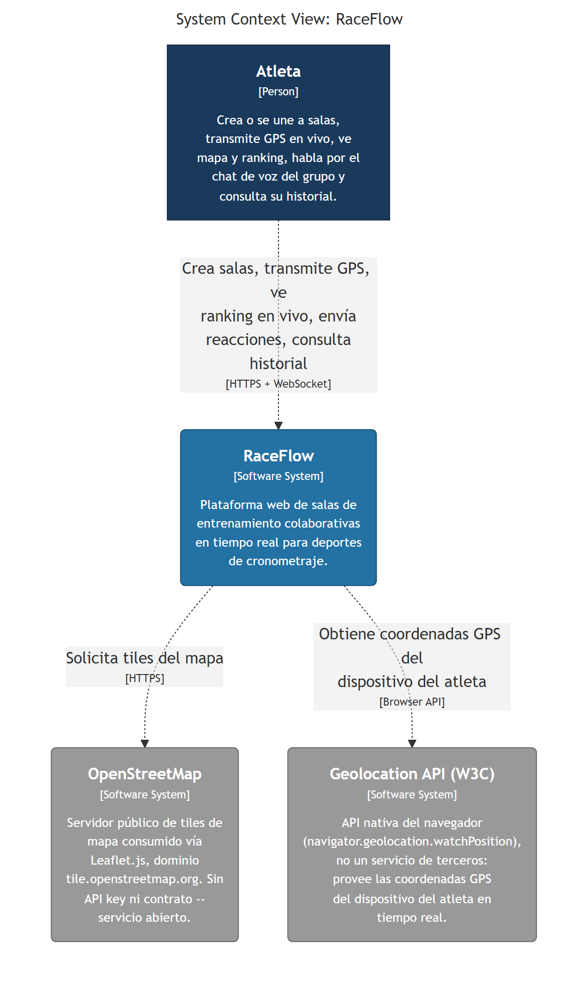
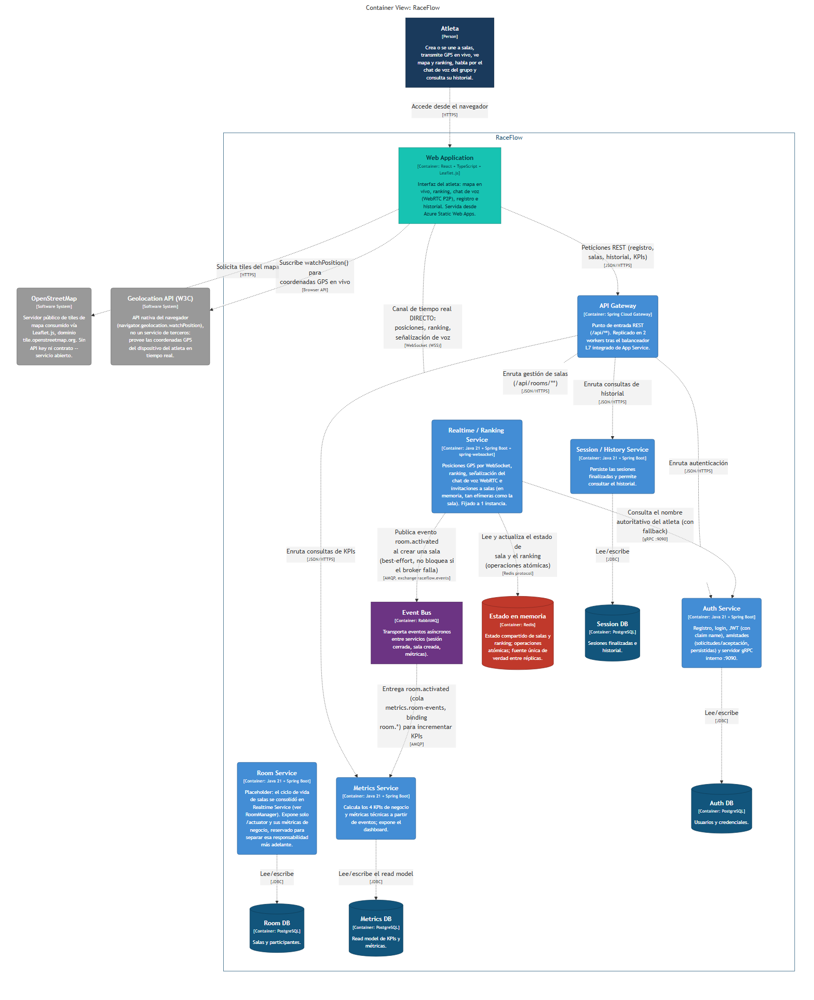
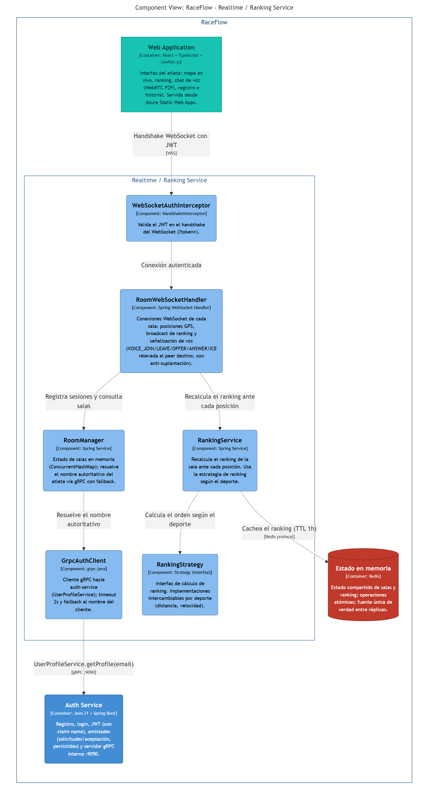

# RaceFlow — Documentación de Arquitectura (C4)

Diagramas de arquitectura del sistema usando el [modelo C4](https://c4model.com/)
y [Structurizr Lite](https://structurizr.com/help/lite).

> Para el mapeo de los estilos de comunicación distribuida (sockets, HTTP, RMI, gRPC,
> microservicios, API Gateway) contra la arquitectura real de RaceFlow, ver
> [EVOLUCION_ARQUITECTONICA.md](EVOLUCION_ARQUITECTONICA.md).

## Diagramas exportados

### Nivel 1 — Contexto del sistema

> El Atleta interactúa con la plataforma RaceFlow a través de HTTPS y WebSocket.
> RaceFlow consume **OpenStreetMap** (tiles del mapa, servicio abierto sin API key) y la
> **Geolocation API (W3C)** del navegador (`navigator.geolocation.watchPosition`, no es un
> servicio de terceros).



### Nivel 2 — Contenedores

> Detalla los contenedores desplegables: la SPA React, el API Gateway (Spring Cloud Gateway),
> los 5 microservicios Spring Boot, Redis, RabbitMQ y las 4 bases de datos PostgreSQL.
> **Room Service es un placeholder** -- el ciclo de vida de salas se consolidó en Realtime
> Service (`RoomManager`) y Room Service solo expone `/actuator` y sus métricas de negocio.
> La mensajería vía RabbitMQ es real: Realtime Service publica `room.activated` al crear una
> sala (best-effort) y Metrics Service lo consume para incrementar sus KPIs.



### Nivel 3 — Componentes del Realtime Service

> Zoom interno del servicio más crítico: `RoomWebSocketHandler` → `RoomManager` (estado de
> salas + resolución del nombre autoritativo vía `GrpcAuthClient`) → `RankingService` →
> `RankingStrategy` (Strategy, intercambiable por deporte) → Redis (caché del ranking, TTL 1h).
> La autenticación del WebSocket ocurre en el handshake vía `WebSocketAuthInterceptor`, no en
> esta cadena de componentes.



---

## Editar y visualizar los diagramas

**Requisito:** Docker Desktop instalado.

Desde esta carpeta (`docs/architecture/`):

```bash
docker compose up
```

Abrir en el navegador: **http://localhost:8080**

Para detenerlo:

```bash
docker compose down
```

## Editar el DSL y ver cambios en vivo

1. Edita [`workspace.dsl`](workspace.dsl) con cualquier editor de texto.
2. Guarda el archivo.
3. Refresca **http://localhost:8080** — Structurizr Lite detecta los cambios automáticamente.

No es necesario reiniciar el contenedor.

## Vistas disponibles

| Vista | ID | Descripción |
|---|---|---|
| **System Context** | `Contexto` | Actores externos y relación de alto nivel con RaceFlow |
| **Containers** | `Contenedores` | SPA + Gateway + 5 microservicios + Redis + RabbitMQ + 4 DBs |
| **Component** | `Componentes_Realtime` | Componentes internos del Realtime/Ranking Service |

## Estructura

```
docs/architecture/
├── workspace.dsl       ← modelo C4 en DSL de Structurizr
├── workspace.json      ← estado generado por Structurizr Lite
├── docker-compose.yml  ← levanta Structurizr Lite en :8080
├── README.md           ← este archivo
└── export/
    ├── structurizr-Contexto.png
    ├── structurizr-Contexto.mmd
    ├── structurizr-Contenedores.png
    ├── structurizr-Contenedores.mmd
    ├── structurizr-Componentes_Realtime.png
    └── structurizr-Componentes_Realtime.mmd
```

## Referencia rápida del DSL

| Elemento | Descripción |
|---|---|
| `softwareSystem` | Sistema completo o sistema externo |
| `container` | Proceso/aplicación desplegable dentro del sistema |
| `component` | Unidad de código dentro de un contenedor |
| `person` | Actor humano que interactúa con el sistema |
| `autoLayout lr` | Disposición automática izquierda → derecha |
| tag `"Database"` | Renderiza el shape como cilindro |
| tag `"Cache"` | Cilindro rojo (Redis) |
| tag `"Broker"` | Pipe (RabbitMQ) |